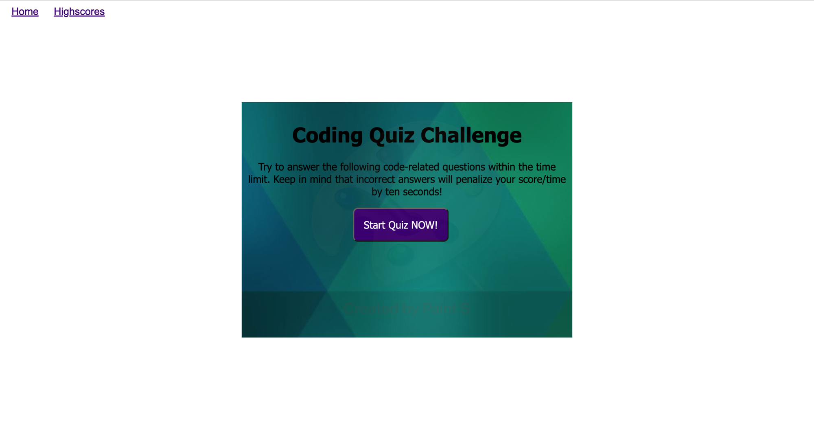
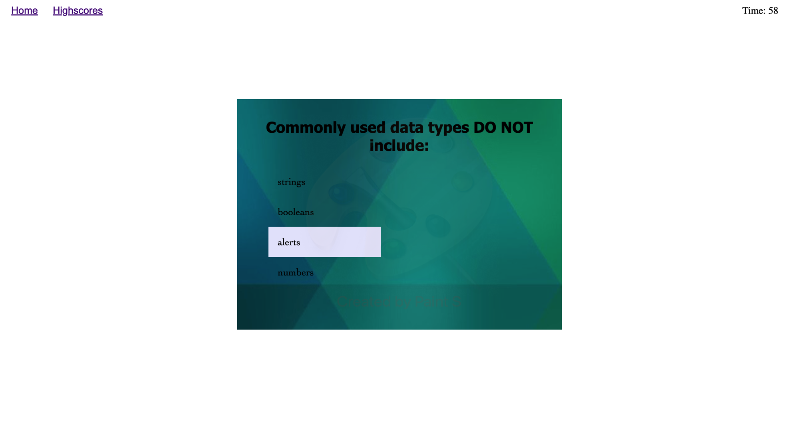
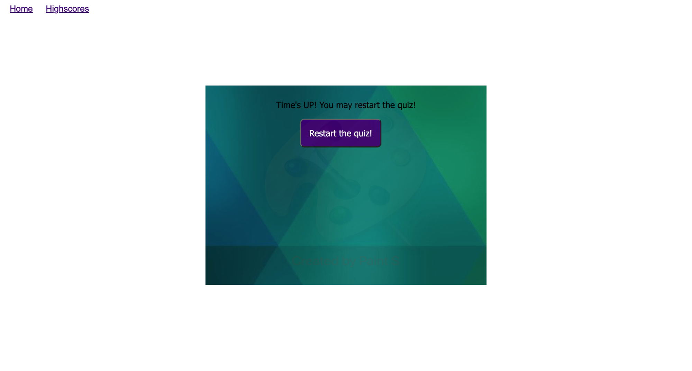
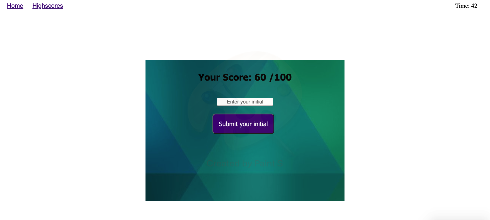
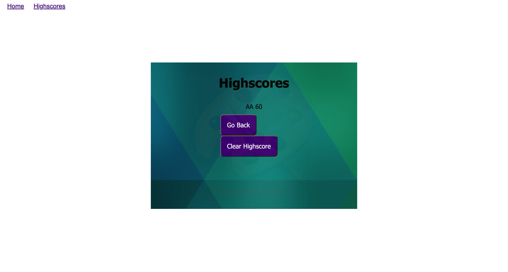

# Code-Quiz

## This is the repository for the code quiz

### Steps:

1. Click the "start" button to start playing
   

2. Timer started and count down for 1 minute
   

3. If the time run out, the user may restart the game
   

4. Enter initial to save the score after finishing the quiz
   

5. User can check the score on highscore page
   

### Link:

Click [https://angelawong3.github.io/code-quiz/](https://angelawong3.github.io/code-quiz/) to go to the page.

---

© Angela Wong
